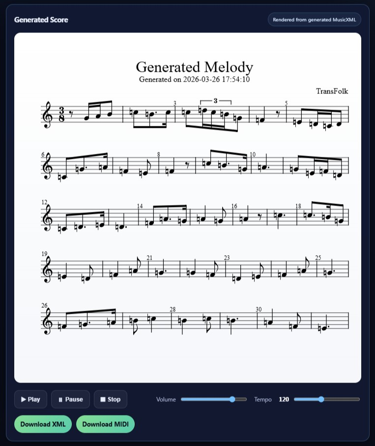
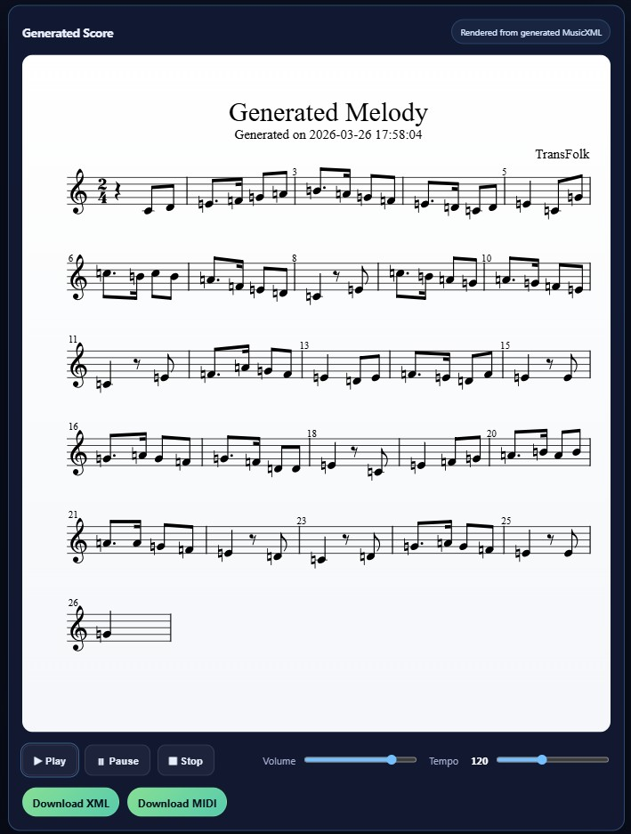
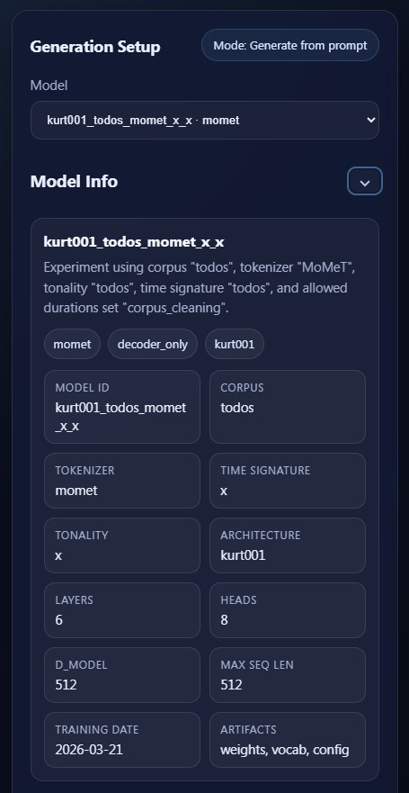
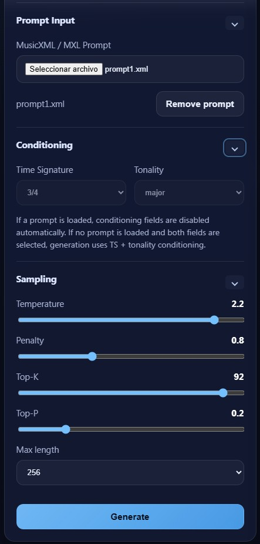
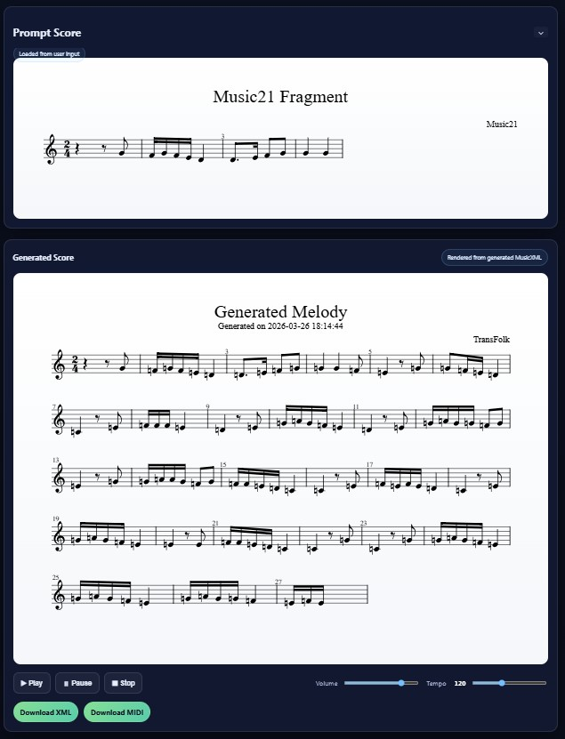

<h1 align="center">TransFolk</h1>

<h2 align="center">Transformer-Based Generation of Folk Melodies</h2>

  <b>Symbolic AI for structured, style-aware folk melody generation</b>

<h2 align="center">
  <a href="https://transfolk.netlify.app/">Open the TransFolk Web App</a>
</h2>

  <a href="https://doi.org/10.1007/978-3-032-27827-2_38"><b>Paper DOI: 10.1007/978-3-032-27827-2_38</b></a>

---

## Overview

**TransFolk** is a transformer-based system for generating monophonic folk melodies from a curated Iberian symbolic music corpus. The project combines symbolic music preprocessing, tokenisation, neural sequence modelling, generation, evaluation, API deployment, and an interactive web interface.

The current version of the project is deployed as a web application and exposes trained symbolic music models through a FastAPI backend. Users can inspect available models, configure generation parameters, condition generation from symbolic prompts, and render generated melodies as musical scores.

---

## Live Project

The interactive frontend is available here:

<h2>
  <a href="https://transfolk.netlify.app/">https://transfolk.netlify.app/</a>
</h2>

The deployed application provides:

* Model selection and model metadata inspection.
* Parameter-controlled melody generation.
* Prompt-conditioned generation from symbolic input.
* MusicXML-based score rendering.
* Playback-ready generated outputs.
* Integration with a deployed FastAPI backend.

---

## Product Preview

### Generated Melodies

Outputs are rendered as structured musical scores:

  

  

---

### Interactive Model Inspection

Each model exposes full metadata for reproducibility and analysis:

  

---

### Generation Control Interface

Fine-grained control over sampling parameters:

  

---

### Prompt Conditioning

The system allows generation conditioned on real symbolic input:

  

---

## Current Project Status

The latest version of TransFolk includes the following updates:

* Public frontend deployed on **Netlify**.
* FastAPI backend deployed externally for model inference.
* Runtime model discovery through a backend model registry.
* Support for released model weights and model metadata stored outside the frontend.
* Multiple released models can be exposed by the backend when their `.pt` weights and `.json` configuration files are available.
* Generated outputs are served through backend output endpoints and consumed by the frontend.
* The frontend now integrates model listing, model details, generation controls, score rendering, and playback-oriented output handling.
* The system is structured as a deployable research prototype rather than only a local training repository.

---

## Main Features

* Decoder-only Transformer architecture implemented with **PyTorch**.
* Symbolic melody generation from learned folk-style representations.
* Modular design prepared for future architectures, including encoder-decoder and hierarchical approaches.
* Multiple tokenisation strategies:
  * Event-based tokenisation.
  * Metric-aware tokenisation.
  * Pattern-aware tokenisation.
* Conditioning support for:
  * Time signatures.
  * Tonality or modal context.
  * Symbolic melodic prompts.
* Generation of symbolic music outputs suitable for:
  * MusicXML rendering.
  * MIDI-oriented playback workflows.
  * Web-based score visualisation.
* Evaluation framework including:
  * Token entropy.
  * Conditional entropy.
  * Modal stability.
  * Pattern retention metrics.
  * One-class style classification.
* Interactive frontend for non-technical use.
* API-based architecture for separating model inference from the web client.

---

## System Architecture

TransFolk is organised around three main layers:

### 1. Core Research Layer

The core layer contains the symbolic music representation, tokenizer logic, model definitions, training utilities, generation routines, and evaluation tools.

### 2. Backend Inference Layer

The backend exposes trained models through an API. Its responsibilities include:

* Loading released model configurations.
* Loading trained model weights.
* Listing available models.
* Running symbolic generation.
* Returning generated MusicXML and related output files.
* Serving generated outputs to the frontend.

Main API capabilities include:

* `GET /health` — backend health check.
* `GET /models` — list available released models.
* `POST /generate` — generate a melody using selected parameters.
* `POST /generate_from_xml` — generate from a symbolic MusicXML prompt.
* `POST /generate_from_TS_tonality` — generate from time-signature and tonality conditioning.
* `GET /outputs/{filename}` — retrieve generated output files.

### 3. Frontend Interaction Layer

The frontend provides the public user interface for generation and model inspection. It connects to the backend API and renders musical outputs in the browser.

---

## Model Releases

Released models are handled as deployable artifacts. A released model normally includes:

* `.pt` — trained PyTorch weights.
* `.json` — model configuration and experiment metadata.
* Vocabulary/tokenisation metadata required to reconstruct the model interface.

The backend model registry reads available released models and exposes them to the frontend. This makes it possible to add new trained models without changing the frontend code, provided that the backend can access the corresponding weights and metadata.

Current released model families include variants such as:

* `mick003_todos_momet_x_x`
* `mick006_todos_momet_x_x`

---

## Research Context

TransFolk investigates the use of transformer-based symbolic generation for folk melody modelling. The project focuses on the relationship between musical representation and generative behaviour, with special attention to:

* Structural coherence.
* Stylistic consistency.
* Tokenisation strategy.
* Prompt conditioning.
* Entropy–structure trade-offs.
* Reproducibility of symbolic music generation experiments.

The system has been designed both as a research prototype and as a usable web-based demonstrator for generated folk melodies.

---

## Publication

Martínez-Rodríguez, B. (2026). *TransFolk: Transformer-Based Generation of Folk Melodies*. Proceedings of the 10th International Conference of Mathematics and Music. Springer.

Published: **2026-06-13**

DOI: <a href="https://doi.org/10.1007/978-3-032-27827-2_38">https://doi.org/10.1007/978-3-032-27827-2_38</a>

---

## Author

**Brian Martínez-Rodríguez**

GitHub: <a href="https://github.com/BrianComposer">https://github.com/BrianComposer</a>

Email: <a href="mailto:info@brianmartinez.music">info@brianmartinez.music</a>

Web: <a href="https://www.brianmartinez.music">www.brianmartinez.music</a>

---

## License

MIT License
